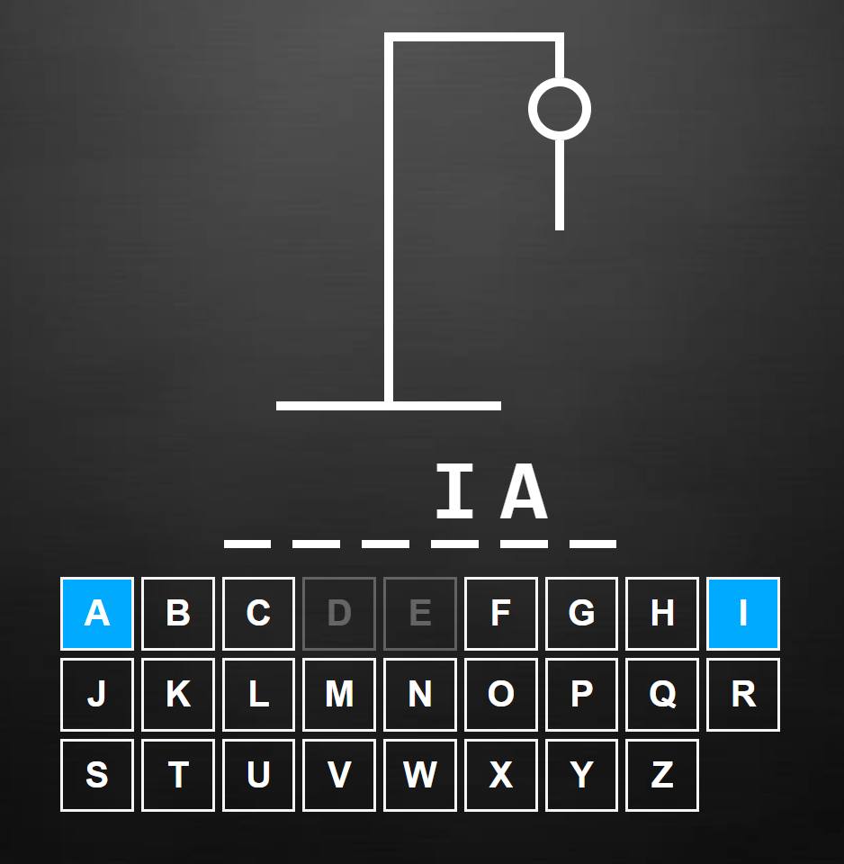

# Hangman 🎮

This project is a recreation of the classic letter guessing game called Hangman. You are shown a set of blank letters that match a word or phrase and you have to guess what these letters are to reveal the hidden word. However, if you pick a letter that is not in the word, then a stickman is slowly drawn. With each wrong letter guess, the man is drawn more and more. When the man is finished, he is hung and the game is lost.

Would you discover the word before the man is draw? Discover it and have fun🕹️!
